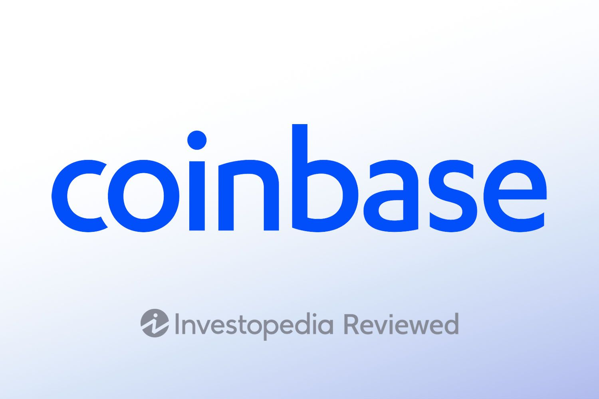

# COINBASE

### What is the background of your company? What do they do? Who are their competitors?
Coinbase is a San Francisco-based cryptocurrency exchange platform. It was founded in 2012 by Brian Armstrong and Fred Ehrsam
with the aim of creating an easy-to-use platform that would enable people to buy, sell, and store cryptocurrencies such as Bitcoin, 
Ethereum, and others crytpcurrencies. Since then, Coinbase has grown to become one of the largest and most reputable cryptocurrency exchanges in the world, 
with over 68 million registered users across 100+ countries. Thier competitors include other cryptocurrency exchanges such as 
Binance, Kraken, and Gemini. In addition, traditional financial institutions such as PayPal and Square have also started offering 
cryptocurrency services, making them indirect competitors to Coinbase.

### How does this company use technology to their advantage? Why are they considered a FinTech company?

Coinbase relies on web3.0 and redundant blockchain infrastructure.  It uses multi-cloud computing to generate an enterprise grade platform as a service. 
It utilizes the use of 50 technological products.  AWS is the cloud company of choice by Coinbase.
The end product is a platform that allowns consumers to buy and sell cryptocurrencys, amongst others.

AWS offers a wide range of tools and services that cover Coinbase needs, including:

AWS Identity and Access Management (IAM) to securely control access to AWS services;
Amazon Relational Database Service (Amazon RDS) to easily set, use, and scale relational databases in the cloud;
Amazon Elastic Compute Cloud (Amazon EC2) with the deepest and broadest computing platform, offering over 475 instances and set of the latest processors, storages, networks, operation systems, and purchase models for practically any load;
AWS Availability Zones to distribute apps natively around the globe;
Amazon Kinesis to seamlessly collect, process, and analyze real-time streaming data to get timely insights and respond promptly.
AWS CloudTrail, Amazon Simple Storage Service (Amazon S3), AWS Lambda to get complete, transparent, and indexed audit logs across the IT environment.
Amazon Elastic MapReduce (Amazon EMR) to receive additional big-data insight;
Amazon Redshift to provide a managed petabyte-scale data warehouse;

### Why is this company exemplary in the FinTech space? What are their strengths and weaknesses?
Coinbase is one of the leaders in their sector which is the platform for buying and selling Crypto cureency because of their easy user interface. Anyone can make an account in Coinbase with ease and start buying and selling Crptocurrencies right away.  
##### Strenghts: 
* Reward Program
* Mobile app
* Wide selections of Cryptocurrencies
* Low account minimum
* Convenient user experience
* Spot trading

##### Pros:
* High fees on transactions
* Complications 

### What is the prognosis for this company? Where do they expect to be in the future?
I expect Bitcoin and Ether to survive the crypto winter even as some of the smaller cryptocurrencies and more troubled exchanges die out. 
That said, I believe the crypto winter could also drag on for years as economic malaise and higher interest rates cause investors to stay away from the crypto market.
Coinbase's survival will hinge entirely on the length of that downturn, which is impossible to accurately predict.
Coinbase's position as a well-established, regulated player in the market may give it a distinct advantage in the face of market disruption. 
As the cryptocurrency market continues to evolve and mature, Coinbase's strength and stability could make it a key player in the industry for years to come.
In addition to benefiting from FTX’s demise, we also believe that Coinbase could benefit from increased demand for cryptocurrencies as well as institutional adoption of digital assets such as Bitcoin and Ethereum. 
As more institutional investors enter the space, they will likely look towards established exchanges such as Coinbase when trading these assets.

 

##### Contributors
1) Mohammad Zahur
2) Sujandar Mahesan
3) Brandon Petrie
4) John Yin
